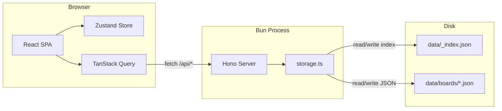
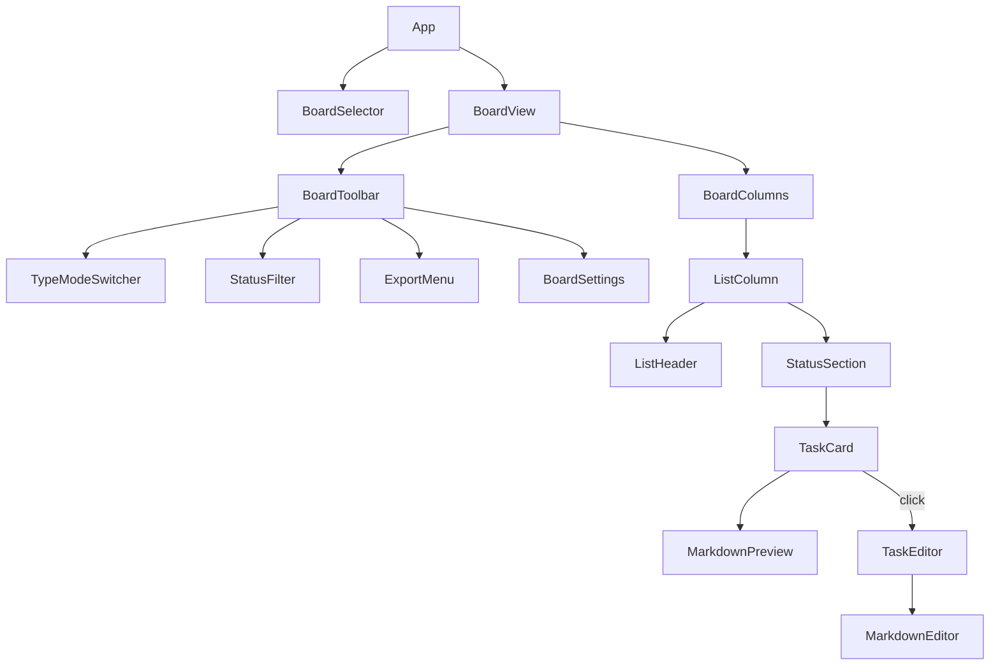

# TaskManager — Local Board App (Phased)

## Tech Stack

- **Runtime**: Bun
- **Backend**: Hono (serves API + static SPA build)
- **Frontend**: React 19 + TypeScript
- **Build**: Vite 6
- **Styling**: Tailwind CSS 4 + shadcn/ui
- **Client state**: Zustand (UI prefs — active type, visible statuses)
- **Server state**: TanStack Query v5 (caching, optimistic updates)
- **Drag and Drop**: @dnd-kit
- **Markdown editing**: @uiw/react-md-editor
- **Markdown rendering**: react-markdown
- **IDs**: nanoid

## Architecture



Single Bun process. Vite proxies `/api/*` to Hono in dev. In production mode, Hono serves the built Vite assets directly.

## Data Model

All types live in `src/shared/models.ts` and are shared between server and client.

```typescript
interface Board {
  id: string;
  name: string;
  backgroundImage?: string;
  taskTypes: string[];           // ["feature", "bug", "enhancement"]
  statusDefinitions: string[];   // ["open", "in-progress", "closed"]
  activeTaskType: string;
  visibleStatuses: string[];
  showCounts: boolean;
  lists: List[];
  tasks: Task[];
  createdAt: string;
  updatedAt: string;
}

interface List {
  id: string;
  name: string;
  order: number;
  color?: string;
}

interface Task {
  id: string;
  listId: string;
  title: string;
  body: string;                  // Markdown
  type: string;
  status: string;
  order: number;                 // Within (list, status) section
  color?: string;
  createdAt: string;
  updatedAt: string;
}
```

Tasks are stored flat (sibling to lists) with a `listId` foreign key. This makes filtering by type/status a simple `.filter()` without nested traversal.

## On-Disk Storage

```
data/
  _index.json              # [{id, name, createdAt}]
  boards/
    {board-id}.json        # Full board document (lists + tasks)
```

One JSON file per board. Cursor can open any board file and read all tasks directly. The `_index.json` gives a table of contents.

## API Routes

Five thin routes -- the server is purely a file I/O proxy with no business logic.

- **GET** `/api/boards` -- List all boards (from `_index.json`)
- **POST** `/api/boards` -- Create board, write new file
- **GET** `/api/boards/:id` -- Read board JSON from disk
- **PUT** `/api/boards/:id` -- Overwrite board JSON to disk
- **DELETE** `/api/boards/:id` -- Remove board file + index entry
- **GET** `/api/boards/:id/export` -- Export with `?format=md|json` and optional type/status filters

All routes defined in `src/server/routes/`. The storage layer in `src/server/storage.ts` handles atomic file writes (write to temp then rename).

## UI Component Tree



### Board layout and task grouping

The board body is **not** a single spreadsheet grid (global status rows × list columns). It is a **horizontal strip of full-height list columns** (`BoardColumns`), each containing **vertical status sections** (`StatusSection`). Lists are ordered by `list.order` and scroll horizontally when there are many columns; Phase 10 adds drag-to-reorder along that strip.

Grouping is still `(listId, status, activeTaskType)` -- only the **presentation** is column-first:

```typescript
board.lists
  .sort(byListOrder)
  .map(list =>
    visibleStatuses.map(status =>
      tasks.filter(t =>
        t.type === activeTaskType &&
        t.listId === list.id &&
        t.status === status
      ).sort(byOrder)
    )
  )
```

Each `ListColumn` has a fixed minimum width, uses the viewport height for a “full lane” feel, and scrolls internally if content overflows.

## Project File Structure

```
taskmanager/
  package.json
  bunfig.toml
  vite.config.ts
  tsconfig.json
  tailwind.config.ts
  components.json                    # shadcn/ui config
  src/
    shared/
      models.ts                      # Board, List, Task types
    server/
      index.ts                       # Hono app entry
      routes/
        boards.ts
        export.ts
      storage.ts                     # Atomic JSON file read/write
    client/
      main.tsx
      App.tsx
      api/
        queries.ts                   # TanStack Query hooks
        mutations.ts                 # Optimistic update mutations
      store/
        board-ui.ts                  # Zustand: active type, visible statuses
      components/
        layout/
          AppShell.tsx
          Sidebar.tsx                # Board list + create
        board/
          BoardView.tsx
          BoardToolbar.tsx
          BoardColumns.tsx
          ListColumn.tsx
          StatusSection.tsx
          TypeModeSwitcher.tsx
          StatusFilter.tsx
        task/
          TaskCard.tsx
          TaskEditor.tsx             # Modal with markdown editor
        list/
          ListHeader.tsx
          ListSettings.tsx
        shared/
          MarkdownViewer.tsx
          ColorPicker.tsx
          ExportDialog.tsx
      hooks/
        useBoard.ts
        useDragHandlers.ts
  data/                              # Created at runtime
    _index.json
    boards/
```

---

## Phased Implementation

Each phase builds on the previous one. At the end of every phase the app should be runnable and testable.

---

### Phase 1 -- Bootstrapping

Set up the project skeleton so that `bun run dev` starts a working Vite dev server proxied to a Hono backend that returns an empty JSON response.

- `bun init`, install all runtime and dev dependencies
- Configure `vite.config.ts` (React plugin, API proxy to Hono)
- Configure `tsconfig.json` (path aliases, strict mode)
- Configure Tailwind CSS 4 + shadcn/ui (`components.json`)
- Create `src/shared/models.ts` with `Board`, `List`, `Task` interfaces and default type/status constants
- Create `src/server/index.ts` -- minimal Hono app that responds to `GET /api/health`
- Create `src/client/main.tsx` + `App.tsx` -- minimal React render with "Hello TaskManager"
- Verify `bun run dev` starts both Vite and Hono and the proxy works

---

### Phase 2 -- Basic Boards

CRUD for boards (server + client). The user can create, rename, open, switch, and delete boards via a sidebar.

- Build `src/server/storage.ts` -- atomic JSON read/write helpers, ensure `data/` and `data/boards/` directories on startup
- Build `src/server/routes/boards.ts` -- GET/POST `/api/boards`, GET/PUT/DELETE `/api/boards/:id`
- Wire routes into `src/server/index.ts`
- Build `src/client/api/queries.ts` -- TanStack Query hooks for `useBoards()` and `useBoard(id)`
- Build `src/client/api/mutations.ts` -- `useCreateBoard`, `useUpdateBoard`, `useDeleteBoard` with optimistic updates
- Build `AppShell.tsx` -- layout shell with sidebar slot and main content area
- Build `Sidebar.tsx` -- board list, "New Board" button, active board highlight, delete action
- Build `BoardView.tsx` -- placeholder that shows the loaded board name when selected
- Simple state-based routing (Zustand or URL hash) to track selected board id

---

### Phase 3 -- Empty Lists (CRUD)

List metadata and mutations exist; the board body can show a minimal placeholder until Phase 3B.

- Build `ListHeader.tsx` -- displays list name, inline rename on double-click, delete button
- Add "New List" button to `BoardView.tsx` (or toolbar area)
- Add list mutations to `mutations.ts` -- `useCreateList`, `useRenameList`, `useDeleteList`
- `BoardView` shows the loaded board name and list CRUD; optional short empty-state copy until columns exist

---

### Phase 3B -- Column layout (full lists)

The **physical** board is a row of **full-height list columns** (Kanban-style lanes), not a single CSS grid of global status rows. Status splits sit **inside** each column. Data is still keyed by `(listId, status)`; only layout changes.

- Build `BoardColumns.tsx` -- horizontal scroll container (`flex` / `overflow-x-auto`); render one column per list sorted by `list.order`
- Build `ListColumn.tsx` -- column chrome: `ListHeader` on top, full-height body below for stacked `StatusSection` components
- Build `StatusSection.tsx` -- labeled block per status (empty drop area for later DnD); for 3B use `board.statusDefinitions` or a single default status until Phase 6 toggles `visibleStatuses`
- Wire `BoardView` to render `BoardColumns` when the board has lists; many lists cause horizontal scroll
- Structure columns so Phase 10 can attach **horizontal** @dnd-kit reorder on the strip (drag whole column or header handle) without restructuring

---

### Phase 4 -- Basic Tasks

Users can create, view, edit, and delete tasks. Tasks appear inside the correct **status section** of the correct **list column**.

- Build `TaskCard.tsx` -- compact card showing title and a truncated body preview
- Build `TaskEditor.tsx` -- modal/dialog with fields: title (input), body (textarea for now), type (select), status (select)
- Add task mutations -- `useCreateTask`, `useUpdateTask`, `useDeleteTask`
- Add "Add Task" button inside each `StatusSection`
- Render tasks by filtering `board.tasks` by `(listId, status)` within that section (show all types for now)
- Build `src/client/store/board-ui.ts` -- Zustand store with `activeTaskType` and `visibleStatuses` state

---

### Phase 5 -- Task Type Filtering

The board-level type switcher filters which tasks are visible **inside every column’s sections**.

- Build `TypeModeSwitcher.tsx` -- tab bar or segmented control showing board's `taskTypes`
- Wire `activeTaskType` from Zustand store to the filter used when rendering tasks in each `StatusSection`
- Update task rendering so `t.type === activeTaskType` (or equivalent) applies consistently in every `ListColumn`
- Build `BoardToolbar.tsx` as the container bar above `BoardColumns`, embed `TypeModeSwitcher`
- Persist `activeTaskType` back to the board JSON on change (via `useUpdateBoard`)

---

### Phase 6 -- Task Status Breakdown

Users toggle which **status sections** appear **inside each list column** (same set of statuses for every column, in a consistent order).

- Build `StatusFilter.tsx` -- checkbox/toggle list of `board.statusDefinitions`
- Wire `visibleStatuses` from Zustand store so each `ListColumn` renders one `StatusSection` per visible status
- Status labels live on each section header inside the column -- not a global grid label column
- Embed `StatusFilter` in `BoardToolbar`
- Persist `visibleStatuses` back to the board JSON on change

---

### Phase 7 -- Export

Export the current board (or filtered view) as Markdown or JSON.

- Build `src/server/routes/export.ts` -- `GET /api/boards/:id/export?format=md|json&type=X&status=Y`
- Server-side Markdown formatter: board name, then per-list sections, then per-status task bullets
- Build `ExportDialog.tsx` -- format selector (md/json), optional type and status filters, download button
- Embed `ExportMenu` trigger in `BoardToolbar`
- Wire download to fetch the export endpoint and trigger a file save

---

### Phase 8 -- Advanced Board

Board-level settings panel and visual enhancements.

- Build `BoardSettings.tsx` -- dialog/drawer with:
  - Rename board
  - Manage task types (add/remove)
  - Manage status definitions (add/remove)
  - Toggle `showCounts`
  - Set background image URL
- Apply board background image as a CSS background on `BoardView`
- Render count badges on list headers (task count per list for active type)
- Render count badges on **status section** headers (task count per status for active type)

---

### Phase 9 -- Advanced Tasks

Rich markdown editing, task colors, and drag-and-drop for tasks.

- Replace plain textarea in `TaskEditor` with `@uiw/react-md-editor`
- Build `MarkdownViewer.tsx` using `react-markdown` for card preview
- Build `ColorPicker.tsx` and add it to `TaskEditor` for per-task color
- Apply task color as a left-border or background tint on `TaskCard`
- Implement @dnd-kit for task reorder within a `StatusSection` (`SortableContext` per section)
- Implement @dnd-kit cross-section task movement (changes `listId` and/or `status`)
- Build `src/client/hooks/useDragHandlers.ts` with optimistic reorder logic
- Wrap `BoardColumns` (or the list-column subtree) in `DndContext`

---

### Phase 10 -- Advanced Lists

List visual customization and drag-and-drop **column** reordering along the horizontal strip.

- Add accent color field to `ListHeader` (small color dot or header border)
- Build `ListSettings.tsx` -- popover to set list color
- Implement @dnd-kit horizontal drag to reorder `ListColumn` siblings inside `BoardColumns`
- Update `list.order` for all affected lists on drop and persist

---

### Phase 11 -- Polish

Final visual refinements and edge-case handling.

- Empty states: no boards, no lists, no tasks in a `StatusSection`
- Responsive layout: collapse sidebar on small screens, horizontal scroll for many lists
- Keyboard accessibility: focus management in modals, escape to close
- Loading and error states for all async operations
- Final spacing, typography, and color consistency pass
