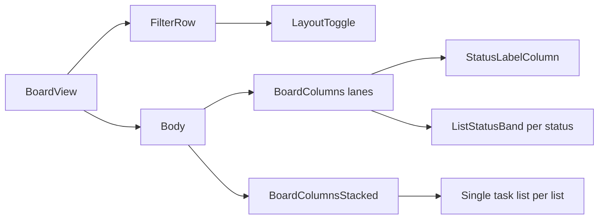

# Stacked list view mode

## Goal

- **Lanes (current):** Full-height columns, status bands with shared left rail (`StatusLabelColumn`), flex weights.
- **Stacked (new):** Each list is one column with **all tasks** matching filters (list + group + visible statuses), **not** split by status. Columns use **natural height** (`align-items: flex-start`), growing with content; cap with `**max-height` + inner `overflow-y-auto`** when a list is long.
- **Persistence:** `boardLayout` stored on the board JSON (same pattern as `visibleStatuses` / `statusBandWeights`) so it survives refresh and syncs with the file-backed API.

## Data and sorting

- Reuse `board.tasks` — no schema beyond `boardLayout`.
- Per list, filter: `listId`, active task group (`useResolvedActiveTaskGroup`), `task.status ∈ visibleStatusesForBoard(board)` (same semantics as today).
- **Sort:** `TASK_STATUSES` index of `task.status`, then `task.order` within the same status — preserves band ordering when merged.

## UI — layout toggle

- Place a **segmented control or icon pair** in the **filter row** in [BoardView.tsx](d:\projects\taskmanager\src\client\components\board\BoardView.tsx) (the block that renders when `!filterCollapsed`, beside [TaskGroupSwitcher](d:\projects\taskmanager\src\client\components\board\TaskGroupSwitcher.tsx) and [BoardStatusToggles](d:\projects\taskmanager\src\client\components\board\BoardStatusToggles.tsx)).
- On change, call `useUpdateBoard` with `boardLayout: "lanes" | "stacked"` (exact string names to match [shared/models.ts](d:\projects\taskmanager\src\shared\models.ts) after you add the field).
- If the filter strip is collapsed, the toggle is hidden — acceptable unless you later duplicate a compact control in the title row (out of scope unless requested).

## UI — stacked board body

- New component e.g. `BoardColumnsStacked` (or parallel entry in [BoardColumns.tsx](d:\projects\taskmanager\src\client\components\board\BoardColumns.tsx)) that:
  - Reuses the same horizontal scroll + `SortableContext` + list reorder behavior as today where possible.
  - **Does not render** [StatusLabelColumn](d:\projects\taskmanager\src\client\components\board\StatusLabelColumn.tsx) (user asked for no rail in stacked mode — “empty” means omit, not an empty column).
  - List cards: drop `h-full` / full-height stretch; use `**items-start`** on the flex row of columns; inner task area: `max-h-[min(...)]` tuned to viewport minus header/filter.
- Per-list body: map merged tasks to [TaskCard](d:\projects\taskmanager\src\client\components\task\TaskCard.tsx); one **Add task** at the bottom that creates with `status: "open"` via existing [useCreateTask](d:\projects\taskmanager\src\client\api\mutations.ts) (same default-group rules as `ListStatusBand`).

## UI — lanes mode tweaks (add task rules + copy)

- [ListStatusBand.tsx](d:\projects\taskmanager\src\client\components\board\ListStatusBand.tsx): show the add affordance **only when `status === "open"`** (hide for `in-progress` and `closed`). New tasks already default to open via `coerceTaskStatus` / create payload.
- Rename user-visible strings: **“Add a card” / “Add card” → “Add task”** (and submit button copy if present).

## UI — task status on cards

- You already fixed statuses to `open` | `in-progress` | `closed` ([TASK_STATUSES](d:\projects\taskmanager\src\shared\models.ts)).
- On **TaskCard**, before the title: small indicator — **open:** empty ring; **in-progress:** yellow/amber filled circle; **closed:** green circle with check. Implement as a tiny sub-component (e.g. `TaskStatusIndicator`) for reuse and a11y (`aria-label` per state).

## Model / server

- Extend `Board` in [src/shared/models.ts](d:\projects\taskmanager\src\shared\models.ts) with optional `boardLayout?: "lanes" | "stacked"`; default in `normalizeBoardFromJson` to `"lanes"` when missing.
- No migration required for existing JSON files.

## Out of scope (explicit)

- **Task drag-and-drop** between statuses or lists — not in this phase; future work will treat moves as `useUpdateTask` status/list changes.
- **BoardListColumnOverlay** / DragOverlay: if list drag overlay looks wrong in stacked mode, add a stacked variant or simplified clone; only if visually broken after implementation.

## Files to touch (primary)

| Area                 | Files                                                                                                                                                               |
| -------------------- | ------------------------------------------------------------------------------------------------------------------------------------------------------------------- |
| Model                | [src/shared/models.ts](d:\projects\taskmanager\src\shared\models.ts)                                                                                                |
| Board shell + toggle | [src/client/components/board/BoardView.tsx](d:\projects\taskmanager\src\client\components\board\BoardView.tsx)                                                      |
| Lanes vs stacked     | [src/client/components/board/BoardColumns.tsx](d:\projects\taskmanager\src\client\components\board\BoardColumns.tsx), new `BoardColumnsStacked.tsx` (or equivalent) |
| List column stacked  | New component + optional shared helper for “tasks for list” sort                                                                                                    |
| List bands           | [src/client/components/board/ListStatusBand.tsx](d:\projects\taskmanager\src\client\components\board\ListStatusBand.tsx)                                            |
| Cards                | [src/client/components/task/TaskCard.tsx](d:\projects\taskmanager\src\client\components\task\TaskCard.tsx)                                                          |

## Verification

- Toggle lanes/stacked; refresh — mode persists.
- Stacked: columns short when few tasks; long lists scroll inside column.
- Lanes: add only on open band; stacked: single Add task creates open tasks.
- Cards show correct status icon in both modes.

