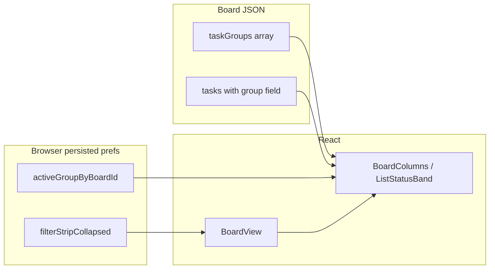

# Task groups — implementation plan

## Goals (user requirements)

- **Naming:** Use **task groups** consistently in UI, shared types, and on-disk JSON (`taskGroups`, task field `group`).
- **Per-board definition:** Users can edit the list of groups for a board; new boards get **app defaults** (placeholder list in code until you supply final defaults).
- **List view:** Single selection — one **active group** or **“All groups”** (no multi-select).
- **Persistence:** **Which group is selected** (per board) lives in **browser storage** via the existing Zustand `persist` pattern (`[src/client/store/preferences.ts](src/client/store/preferences.ts)`), **not** in the board file. **Remove** `activeTaskType` from the board model (it duplicates what you rejected).
- **Header:** Clear layout: **status visibility** (current behavior) + **group switcher**; **collapsible** filter area; **global** collapsed/expanded preference (same idea as sidebar).
- **Layout:** Visible **gap** between the filter block and the horizontal list area so the user can grab the **background / track** to scroll lists without hitting header controls.

## Architecture alignment (`[docs/arch_design_guidelines.md](docs/arch_design_guidelines.md)`)

| Topic          | Decision                                                                                                                                                                                                                                                                                                                                                                                     |
| -------------- | -------------------------------------------------------------------------------------------------------------------------------------------------------------------------------------------------------------------------------------------------------------------------------------------------------------------------------------------------------------------------------------------- |
| Board document | Holds `**taskGroups: string[]`** only (definitions). Does **not** store the active filter selection.                                                                                                                                                                                                                                                                                         |
| Client prefs   | Zustand + `persist` for **per-board active group** (`boardId` → `groupId` or sentinel `"__all__"`) and **global** `boardFilterStripCollapsed` (or similar name). This matches the guideline that a Zustand slice is appropriate for **non-board** UI state; it **updates** the doc’s older note that implied `activeTaskType` on the board — that path is **replaced** for the group filter. |
| Task field     | Rename `**Task.type` → `Task.group`** (string; must be one of the board’s groups for “valid” data; active dev: mismatches acceptable).                                                                                                                                                                                                                                                       |
| Filtering      | Conceptual filter: `(listId, status, group)` when a specific group is selected; when **All**, omit the group predicate. Order still `task.order` within the band.                                                                                                                                                                                                                            |
| shadcn/ui      | Use existing primitives for settings UI, switcher, collapse control ([guidelines § shadcn](docs/arch_design_guidelines.md)).                                                                                                                                                                                                                                                                 |

Update `**docs/arch_design_guidelines.md`** in the same change set: Scope, Data Model snippet, UI filtering pseudocode, “Not yet implemented” item **4** (clarify: group **filter** is client-persisted; group **definitions** remain on the board), and any references to `activeTaskType` / `taskTypes` / `t.type`.

## Data model (`[src/shared/models.ts](src/shared/models.ts)`)

- Rename `DEFAULT_TASK_TYPES` → `DEFAULT_TASK_GROUPS` (values TBD / placeholder until you supply the list).
- Rename `Board.taskTypes` → `**taskGroups**`; remove `**activeTaskType**`.
- Rename `Task.type` → `**group**`.
- Adjust exported types (`TaskType` → `TaskGroup` or drop narrow unions if groups are freeform strings).
- **Migration:** During active dev, optional **read-time normalization** in one place (e.g. when loading a board in the client or a small helper used by server read) mapping legacy `taskTypes` → `taskGroups`, `type` → `group`, is acceptable; otherwise document “re-save board” or tolerate broken rows. No requirement for a formal migration tool unless you want it.

## Server (`[src/server/routes/boards.ts](src/server/routes/boards.ts)`)

- `newBoardDocument`: seed `**taskGroups`** from `DEFAULT_TASK_GROUPS`; **do not** write `activeTaskType`.
- Any validation: optional light checks (non-empty `taskGroups`).

## Client API (`[src/client/api/mutations.ts](src/client/api/mutations.ts)`)

- `buildOptimisticBoard` / create flows: use `**taskGroups`**; remove `activeTaskType`.
- `useUpdateBoard` callers that patch group lists: new mutation or extend existing patterns for **editing `taskGroups`** (optimistic update like other board fields).

## Preferences store (`[src/client/store/preferences.ts](src/client/store/preferences.ts)`)

- Add `**activeTaskGroupByBoardId**`: `Record<string, string>` where values are either a group string or a reserved `**"__all__"**` (or `null` meaning all — pick one convention and use everywhere).
- Add `**boardFilterStripCollapsed**`: boolean, default `false`, **persisted** alongside theme/sidebar.
- **partialize** both so they survive refresh (same `tm-preferences` key or a second key — prefer extending existing blob for one round-trip).

## UI structure

### 1. Board header refactor (`[src/client/components/board/BoardView.tsx](src/client/components/board/BoardView.tsx)`)

- Split into something like:
  - **Title row** (board name; future actions can sit here).
  - **Filter strip** (collapsible): contains `**BoardStatusToggles`** + new `**TaskGroupSwitcher`**.
- **Collapse:** Chevron or “Filters” control toggles visibility of the strip; reads/writes `**boardFilterStripCollapsed`** from preferences.
- **Spacing:** Add `**margin-top` / `gap`** (or `padding-top` on the scroll container) **between** the filter block and `[BoardColumns](src/client/components/board/BoardColumns.tsx)` so the horizontal scroll region has a clear hit target (e.g. `gap-3` or `mt-2` + ensure `BoardColumns` root can receive pointer events for drag-scroll if applicable).

### 2. New: `TaskGroupSwitcher`

- Renders **All groups** + one control per `board.taskGroups` entry (tabs, segmented control, or select — match existing Tailwind/shadcn patterns).
- Reads/writes selection via **preferences store** keyed by `**board.id`**.
- On board load, if stored value is missing or not in `taskGroups` and not `__all__`, **fallback** to `__all__` or first group (document the rule in code comment).

### 3. New: task group definition UI (minimal first)

- Entry point: e.g. **gear / “Task groups”** in the title row or inside the filter strip (Dialog or Sheet).
- **List editor:** add/remove/reorder strings (simple list + inputs; **DragHandle optional** later). Persist with `**useUpdateBoard`** updating `**taskGroups`** only.
- **Defaults:** Pre-fill from `DEFAULT_TASK_GROUPS` for new boards; editing starts from current `board.taskGroups`.

### 4. Task list + editor wiring

- `[ListStatusBand.tsx](src/client/components/board/ListStatusBand.tsx)`: extend `useMemo` filter with **preferences’ active group** for this `board.id`; if `__all__`, no group filter.
- `[TaskEditor.tsx](src/client/components/task/TaskEditor.tsx)`: default and select `**group`** from `board.taskGroups`; save `**group`** on create/update.
- `[TaskCard.tsx](src/client/components/task/TaskCard.tsx)`: display label **Group** (or the group string) instead of “type”.
- **DnD / mutations** (`[BoardColumns.tsx](src/client/components/board/BoardColumns.tsx)`, `[mutations.ts](src/client/api/mutations.ts)`): replace references to `task.type` with `task.group` for ordering bands and moves.

### 5. Repo-wide rename

- Grep for `taskTypes`, `activeTaskType`, `Task.type`, `task.type`, UI copy “type” → update to **group** where it means this concept.

## Testing / acceptance (manual)

- New board: default groups appear; can open editor and change groups; tasks created use selected/default group.
- Switch **All** vs one group: visible tasks in each status band match.
- Refresh browser: **group selection** and **filter strip collapsed** state persist.
- Horizontal scroll: can scroll lists using space **below** the filter strip without accidental toggle clicks.

## Documentation

- Update `[docs/arch_design_guidelines.md](docs/arch_design_guidelines.md)` as above.
- Optionally add a short `**docs/task-groups.md`** only if you want a dedicated reference — otherwise keep scope to the main arch doc per your preference to avoid extra markdown unless needed.

