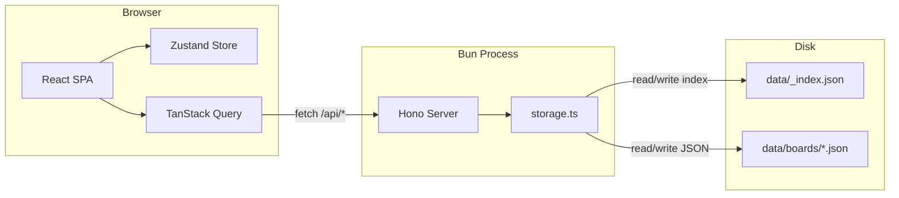
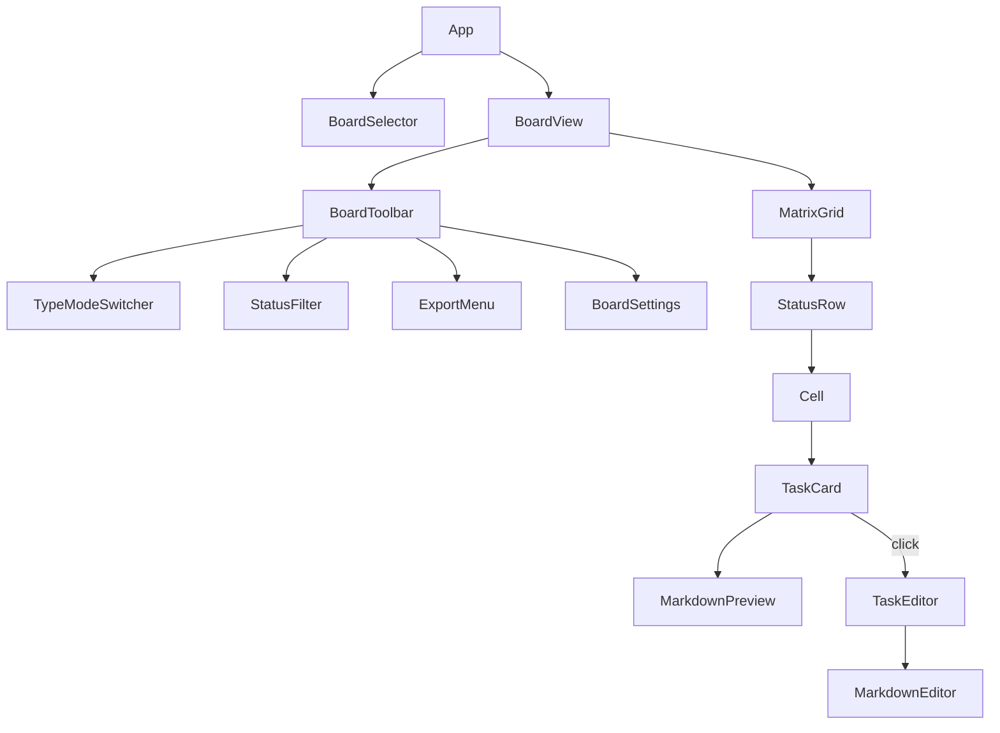

# TaskManager — Local Board App

## Tech Stack

- **Runtime**: Bun
- **Backend**: Hono (serves API + static SPA build)
- **Frontend**: React 19 + TypeScript
- **Build**: Vite 6
- **Styling**: Tailwind CSS 4 + shadcn/ui
- **Client state**: Zustand (UI prefs — active type, visible statuses)
- **Server state**: TanStack Query v5 (caching, optimistic updates)
- **Drag & Drop**: @dnd-kit
- **Markdown editing**: @uiw/react-md-editor
- **Markdown rendering**: react-markdown
- **IDs**: nanoid

## Architecture




Single Bun process. Vite proxies `/api/*` to Hono in dev. In production mode, Hono serves the built Vite assets directly.

## Data Model

All types live in `src/shared/models.ts` and are shared between server and client.

```typescript
interface Board {
  id: string;
  name: string;
  backgroundImage?: string;
  taskTypes: string[];           // ["feature", "bug", "enhancement"]
  statusDefinitions: string[];   // ["open", "in-progress", "closed"]
  activeTaskType: string;
  visibleStatuses: string[];
  showCounts: boolean;
  lists: List[];
  tasks: Task[];
  createdAt: string;
  updatedAt: string;
}

interface List {
  id: string;
  name: string;
  order: number;
  color?: string;
}

interface Task {
  id: string;
  listId: string;
  title: string;
  body: string;                  // Markdown
  type: string;
  status: string;
  order: number;                 // Within (list, status) cell
  color?: string;
  createdAt: string;
  updatedAt: string;
}
```

Tasks are stored flat (sibling to lists) with a `listId` foreign key. This makes filtering by type/status a simple `.filter()` without nested traversal.

## On-Disk Storage

```
data/
  _index.json              # [{id, name, createdAt}]
  boards/
    {board-id}.json        # Full board document (lists + tasks)
```

One JSON file per board. Cursor can open any board file and read all tasks directly. The `_index.json` gives a table of contents.

## API Routes

Five thin routes — the server is purely a file I/O proxy with no business logic.


| Method | Endpoint                 | Action                               |
| ------ | ------------------------ | ------------------------------------ |
| GET    | `/api/boards`            | List all boards (from `_index.json`) |
| POST   | `/api/boards`            | Create board, write new file         |
| GET    | `/api/boards/:id`        | Read board JSON from disk            |
| PUT    | `/api/boards/:id`        | Overwrite board JSON to disk         |
| DELETE | `/api/boards/:id`        | Remove board file + index entry      |
| GET    | `/api/boards/:id/export` | Export with `?format=md              |


All routes defined in `src/server/routes/`. The storage layer in `src/server/storage.ts` handles atomic file writes (write to temp then rename).

## UI Component Tree




### Matrix rendering logic

The core board is a CSS Grid. Columns = lists, rows = visible statuses. Each cell shows tasks matching `(listId, status, activeTaskType)`.

```typescript
visibleStatuses.map(status =>
  board.lists.map(list =>
    tasks.filter(t =>
      t.type === activeTaskType &&
      t.listId === list.id &&
      t.status === status
    ).sort(byOrder)
  )
)
```

CSS: `grid-template-columns: auto repeat(N, 1fr)` where first column is the status label and N = number of lists.

## Drag & Drop Strategy

Using @dnd-kit with `DndContext` at the `MatrixGrid` level:

- **List reorder**: Horizontal drag of list column headers. Updates `list.order` for all affected lists.
- **Task reorder within cell**: Vertical sort within a `SortableContext` per cell.
- **Task move across cells**: Drop on a different cell changes `task.listId` and/or `task.status`. Custom collision detection to identify the target cell.

All DnD handlers live in `src/client/hooks/useDragHandlers.ts`. On drop, Zustand updates optimistically, then a mutation fires to persist.

## Project File Structure

```
taskmanager/
  package.json
  bunfig.toml
  vite.config.ts
  tsconfig.json
  tailwind.config.ts
  components.json                    # shadcn/ui config
  src/
    shared/
      models.ts                      # Board, List, Task types
    server/
      index.ts                       # Hono app entry
      routes/
        boards.ts
        export.ts
      storage.ts                     # Atomic JSON file read/write
    client/
      main.tsx
      App.tsx
      api/
        queries.ts                   # TanStack Query hooks
        mutations.ts                 # Optimistic update mutations
      store/
        board-ui.ts                  # Zustand: active type, visible statuses
      components/
        layout/
          AppShell.tsx
          Sidebar.tsx                # Board list + create
        board/
          BoardView.tsx
          BoardToolbar.tsx
          MatrixGrid.tsx
          StatusRow.tsx
          Cell.tsx
          TypeModeSwitcher.tsx
          StatusFilter.tsx
        task/
          TaskCard.tsx
          TaskEditor.tsx             # Modal with markdown editor
        list/
          ListHeader.tsx
          ListSettings.tsx
        shared/
          MarkdownViewer.tsx
          ColorPicker.tsx
          ExportDialog.tsx
      hooks/
        useBoard.ts
        useDragHandlers.ts
  data/                              # Created at runtime
    _index.json
    boards/
```

## Implementation Order

Work proceeds bottom-up: shared types, then server, then core UI, then interactive features, then polish.