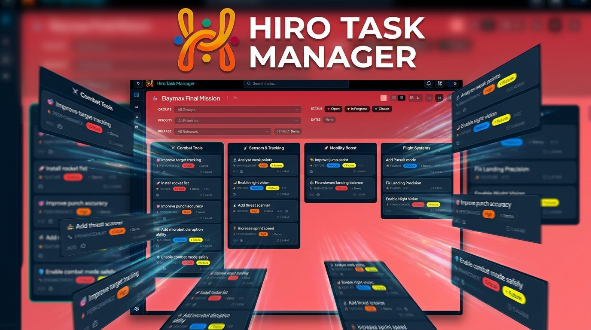

## What is Hiro Task Manager?

Task management for solo builders with endless ideas and a talent for forgetting. Hiro Task Manager adds superpowers to your task lists with AI-agent access control.

[](https://youtu.be/NUSbLk1sZQU)

## Current Status

Hiro Task Manager is in active development and is not yet ready for production use. However it is stable enough to try out and get started with.

## Features

- **Boards & Lists**
  - **Create unlimited boards, lists, and tasks** - Spin up as much structure as you need with no arbitrary caps.
  - **Markdown and Mermaid support** - Use markdown to format your tasks and lists, encourage your AI Agents to build organized task descriptions and diagrams.
  - **Organize your tasks** - Use priorities, statuses, and groups to organize your tasks.
  - **Customize your view** - Board themes, custom task groups, custom statuses, emojis, and multiple board and task views.
- **Agentic workflow**
  - **Manage your lists and tasks** - Let your agents create your tasks and organize them in lists and boards.
  - **Control agent access** - Define exactly what your agent can see or change, using granular CLI Access Control.
  - **Cursor IDE, Claude Code, GitHub Copilot** - powered by `npx skills` to support dozens of AI Agents.
  - **Web notifications** - Stay informed about what your agents are doing on your boards.
- **Productivity**
  - **Keyboard shortcuts** - Developer first, desktop first; keyboard shortcuts for hardcore developers.
  - **Search and filter** - Filter by any field, full-text search.
  - **Instant statistics** - See task counts per list, per status.

## Why Hiro Task Manager?

- **Open source** - Use it, modify it, and extend it; docs and agentic skills help you customize.
- **Cross-platform** - Windows, Linux, and macOS.
- **Works with any AI agent** - supports dozens of AI Agents.
- **Quick to start** - One-line installer, or install via AI agents.
- **Detailed Documentation** - for developers and AI Agents.
- **Your data, your machine, your models** - Privacy stays under your control.

## Install (same machine, server + CLI together)

This is the simplest setup: the server, the web UI, and the CLI all run on the same machine.

1. Install with bun

```bash
bun install -g @hiroleague/taskmanager
```

2. Run the launcher — it walks you through first-run setup, then starts the server

```bash
hirotaskmanager     # interactive: pick port, data dir, open browser, start server
```

   The launcher writes a profile under `~/.taskmanager/profiles/<name>/` and sets it as the default. Loopback-bound (the default) means **no API key** is required for the local CLI.

3. Add AI Agent Skills

```bash
npx skills add hiro-league/hirotaskmanager        # from our repo
npx skills add "$HOME/.taskmanager/skills"        # or from the local install
```

4. Use the CLI from anywhere — no `--profile` needed

```bash
hirotm boards list
```

For **remote/split installs** (server on a VPS, CLI on a desktop), **hardened single-host** setups (loopback + forced API key), and the **developer dual-profile** workflow, see [Advanced setup](https://docs.hiroleague.com/task-manager/get-started/advanced-setup). The full walkthrough lives in the [Quickstart](https://docs.hiroleague.com/task-manager/get-started/quickstart).

## Update

```bash
bun update -g @hiroleague/taskmanager
npx skills update
```

## Two binaries

This package installs two commands on your `PATH`:

| Binary | Use it for |
|--------|------------|
| **`hirotaskmanager`** | First-run setup (`--setup-server`, `--setup-client`), server lifecycle (`server start/stop/status`), CLI API key management (`server api-key generate/list/revoke`), and changing the default profile (`profile use`). |
| **`hirotm`** | Day-to-day data ops: boards, lists, tasks, releases, search, trash. |

Both binaries dispatch into the same code; the split is a UX convention so agents and scripts only ever touch `hirotm`.

## `hirotm` command index

Hiro Task Manager exposes `hirotm` for command-line and AI-agent-friendly control. AI Agents can create, update, and delete entities subject to per-board CLI access control.

| Command | Summary |
|---------|---------|
| **`server`** | Start, stop, and check the server status. |
| **`boards`** | List boards, inspect structure, manage board settings, and handle board trash operations. |
| **`lists`** | List, create, update, move, delete, restore, and purge lists on a board. |
| **`tasks`** | List, create, update, move, delete, restore, and purge tasks. |
| **`releases`** | List, show, create, update, delete, and set-default releases on a board. |
| **`statuses`** | List global workflow statuses. |
| **`query`** | Run full-text task search with `query search`. |
| **`trash`** | Read items currently in Trash. Restore and purge stay under their resource commands. |

## `hirotaskmanager` admin commands

| Command | Summary |
|---------|---------|
| **`--setup-server` / `--setup-client`** | Interactive first-run wizards for server-mode or client-mode profiles. |
| **`server start/stop/status`** | Manage the local server process. |
| **`server api-key generate/list/revoke`** | Mint, list, or revoke CLI API keys (server profile only; file-system only — no HTTP needed). |
| **`profile use <name>`** | Set the default profile so commands run without `--profile`. |

## Contributing

Issues and pull requests are welcome.

## References

- [Hiro Task Manager Documentation](https://docs.hiroleague.com/task-manager)
- [Website](https://hiroleague.com/hiro-task-manager)
