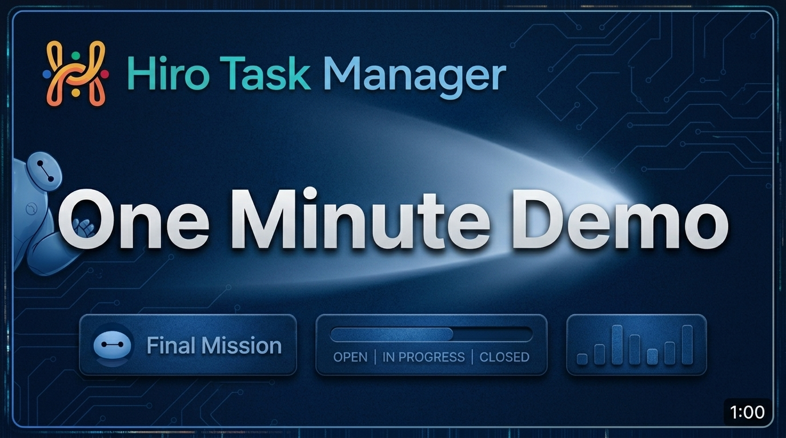
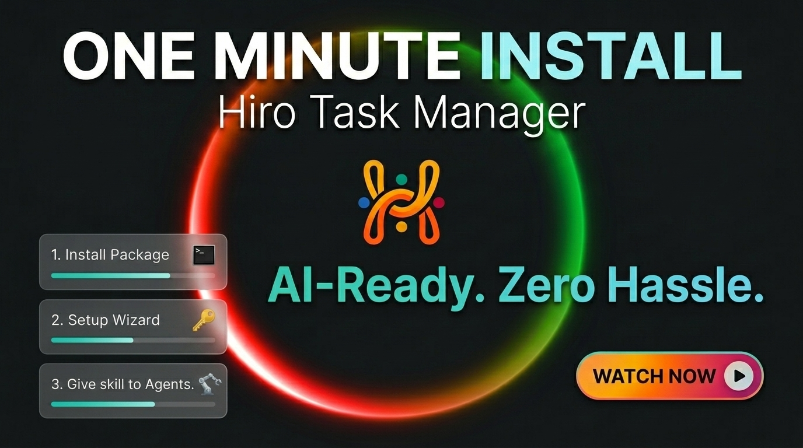

## What is Hiro Task Manager?

[](https://github.com/hiro-league/hirotaskmanager/actions/workflows/ci.yml)
[](https://www.npmjs.com/package/@hiroleague/taskmanager)
[](https://docs.hiroleague.com/task-manager/get-started/quickstart)
[](LICENSE)

Task Management for solo-builders with endless ideas. The task manager your AI agent can safely work with.

**One minute demo** — [Open on YouTube](https://youtu.be/gtlFLINg2oQ)

<a href="https://youtu.be/gtlFLINg2oQ" title="Hiro Task Manager — one minute demo"></a>

**One minute install** — [Open on YouTube](https://youtu.be/laf3w0J6IwU)

<a href="https://youtu.be/laf3w0J6IwU" title="Hiro Task Manager — one minute install"></a>

## Releases

- [0.1.0](https://github.com/hiro-league/hirotaskmanager/releases/tag/0.1.0) - First public release.

## Features

- Create boards for projects, products, clients, or initiatives.
- Use lists to structure work inside each board.
- Track tasks as individual cards with a title and optional details.
- Organize tasks by group, priority, status, and release.
- Filter tasks by group, status, or release.
- Plan milestones with releases, colors, dates, and default release assignment.
- Use Markdown and Mermaid diagrams for richer task descriptions.
- Manage work from the web UI or from the CLI.
- Let AI agents create, update, move, and organize tasks through the CLI.
- Control CLI access per board with access policies.
- Run locally by default, or use a server/client setup for remote access.
- Use profiles to work with local, remote, or server instances.
- Recover deleted boards, lists, and tasks from Trash before purging them.

## Prerequisites

- You need either [bun](https://bun.sh/docs/installation) or [node.js](https://nodejs.org/en/download/), Not both.
- You can replace all bun/bunx commands below with npm/npx commands.

## Install (Local Setup)

Most users will use the Local Setup. If you're into setting the server up on a VPS, visit the [Advanced Setup](https://docs.hiroleague.com/task-manager/get-started/advanced-setup) page.

**1. Install**

```bash
bun install -g @hiroleague/taskmanager
```

**2. First time setup - Interactive walkthrough**

```bash
hirotaskmanager     # Interactive: pick server option and accept all defaults
```

You will be prompted to set a passphrase for website login. A recovery key will be generated for you to recover your access if needed.

**3. Add AI Agent Skills**

```bash
bunx skills add hiro-league/hirotaskmanager        # from our repo
bunx skills add "$HOME/.taskmanager/skills"        # or from the local install
```

Install the skill globally to any AI Agent. Alternatively, install to specific projects or specific agents.


**4. Use the CLI**

```bash
hirotm boards list
```

Go to http://127.0.0.1:3001/ , login, create a board, give it CLI access and your AI Agents can now interact with it.

Need to run the server on VPS and access it from anywhere? Visit the [Advanced Setup](https://docs.hiroleague.com/task-manager/get-started/advanced-setup) page.

## Update

```bash
bun update -g @hiroleague/taskmanager
bunx skills update
```

## Installed Commands

This package installs two commands on your `PATH`:

| Binary | Use it for |
|--------|------------|
| **`hirotaskmanager`** | For Humans. First time setup, profile management and optional server lifecycle management |
| **`hirotm`** | For AI Agents. Start Server, Manage boards, lists and tasks|

## `hirotm` command index

Hiro Task Manager exposes `hirotm` for command-line and AI-agent-friendly control. AI Agents can create, update, and delete entities subject to per-board CLI access control.

| Command | Summary |
|---------|---------|
| **`server`** | Start, stop, and check the server status. |
| **`boards`** | List boards, inspect structure, manage board settings, and handle board trash operations. |
| **`lists`** | List, create, update, move, delete, restore, and purge lists on a board. |
| **`tasks`** | List, create, update, move, delete, restore, and purge tasks. |
| **`releases`** | List, show, create, update, delete, and set-default releases on a board. |
| **`statuses`** | List global workflow statuses. |
| **`query`** | Run full-text task search with `query search`. |
| **`trash`** | Read items currently in Trash. Restore and purge stay under their resource commands. |

## `hirotaskmanager` admin commands

| Command | Summary |
|---------|---------|
| - | First time wizard, pick a server or client mode |
| **`--setup-server`** | First time wizard for server mode |
| **`--setup-client`** | First time wizard for client mode |
| **`server start/stop/status`** | Manage the local server process. |
| **`server api-key generate/list/revoke`** | Mint, list, or revoke CLI API keys (when required) |
| **`profile use <name>`** | Set the default profile so commands run without `--profile` argument. |

## Contributing

Issues and pull requests are welcome.

## References

- [Hiro Task Manager Documentation](https://docs.hiroleague.com/task-manager)
- [Website](https://hiroleague.com/hiro-task-manager)
- [AI agent walkthrough (longer demo on YouTube)](https://youtu.be/NUSbLk1sZQU)
