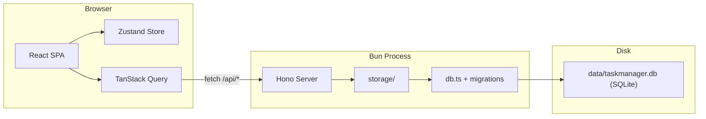

# TaskManager — Architecture & Design Guidelines

Reference for future development. Update this file when architecture or scope changes.

## Resolved decisions

1. **Development runtime** — ~~CLOSED.~~ `npm run dev` runs two processes via `concurrently` (Bun API on fixed port **3001** + Vite dev server). Vite's built-in `server.proxy` forwards `/api` requests to `http://localhost:3001`. No port scanning, no `.dev/api-port` file, no custom proxy plugin.

2. **Production serving** — ~~CLOSED.~~ `npm run build && npm start` runs a single Bun process. Hono serves API routes **and** the Vite-built SPA from `dist/` via `serveStatic` + an `index.html` fallback for client-side routing. Default port is **3001** (override with `PORT` env var). Persistent state lives in **`taskmanager.db`** (SQLite via `bun:sqlite`) under `~/.taskmanager/data` in production (override with `DATA_DIR`); in development it defaults to **`./data`** in the repo root.

## Early development (data & migrations)

Until the app is explicitly versioned or released for external users:

- **No backward-compatibility promise** for the SQLite schema or API payloads. Breaking changes are allowed; during development it is acceptable to **delete `data/taskmanager.db`** and re-run migrations — see **`docs/sqlite_migration.md`** (historical note: one-time JSON import existed during migration; it has been **removed** from the codebase).
- **Primary store:** SQLite (`board`, `list`, `task`, `task_group`, `status`, `board_view_prefs`). **Integer primary keys** for boards, lists, tasks, and task groups. Workflow **status** ids are strings (`open`, `in-progress`, …) from the seeded **`status`** table; the client loads labels and order via **`GET /api/statuses`**.

## Investigation (open decisions / partial implementation)

These items remain open. (Numbering preserved from the original architecture review.)

8. **Project layout vs. code** — Guidelines below list the **current** notable paths. Reconcile occasionally: e.g. board data hooks live in **`src/client/api/queries.ts`** (`useBoard`, `useBoards`), not a separate `hooks/useBoard.ts`; mutation hooks are grouped by entity under **`src/client/api/mutations/`** (barrel **`index.ts`**); board drag-and-drop is implemented in **`BoardColumns.tsx`** (see [Drag & drop](#drag--drop)). New files should extend this structure rather than reintroducing obsolete plan names unless there is a deliberate refactor.

9. **Dependencies** — Keep **`package.json`** aligned with what this doc claims (e.g. major versions). Periodically review upgrades (Vite, React, Hono, TanStack Query, @dnd-kit), security advisories, and whether dev-only tools (`concurrently`, `npx bun` in scripts) match how contributors run the repo.

## Not yet implemented

Planned or described in earlier specs but **absent or incomplete** in the codebase today. (Items **3** and **4** match the architecture review; add more as needed.)

3. **`GET /api/boards/:id/export`** — Markdown/JSON export with optional type/status filters; server route module (e.g. `export.ts`) and any client export UI.

4. **Board vs client prefs** — **`taskGroups`** (`{ id, label }[]`) and **`visibleStatuses`** (subset of workflow statuses) are part of the **assembled board** from the API and update via **granular `PATCH` routes** + TanStack Query. **Which task group is active for filtering** (`ALL_TASK_GROUPS` = all groups, or a specific **group id**) is stored in **`src/client/store/preferences.ts`** (persisted to `localStorage`, keyed by board id). **Filter strip collapsed** is a **global** app preference in the same store. There is **no** `activeTaskType` (or similar) field on the board.

- **Other plan gaps** — e.g. full board settings beyond task groups, shared `ExportDialog`, etc., may still be missing; treat the repo as source of truth and extend this list when you add features.

## Scope

Browser-based, **local-only** task board: SQLite persistence with **list columns** (each list is a column) and **stacked status bands** inside each column. Workflow **status** is a string id (seeded defaults include `open`, `in-progress`, `closed`; more can be added via migrations). Each task has a **`groupId`** (integer FK) referencing the board’s **`taskGroups`**; the list view can filter by one group or show all (filter selection is client-persisted, not in the DB row beyond the task’s `group_id`).

## Tech Stack

| Layer | Choice |
| ----- | ------ |
| Runtime | Bun |
| Backend | Hono (API routes + static SPA in production via `serveStatic`) |
| Frontend | React 19 + TypeScript |
| Build | Vite (see `package.json` for current major version) |
| Styling | Tailwind CSS 4 + shadcn/ui |
| Client routing | React Router (`react-router-dom`) — **which board is open** is defined by the URL (see [Client routing](#client-routing)); not duplicated in a board-selection store |
| Client UI state | Zustand: **`store/preferences.ts`** (theme, sidebar, **task group filter per board**, **board filter strip collapsed**); board fields (`taskGroups`, `visibleStatuses`, etc.) via TanStack Query + granular board API |
| Server / remote state | TanStack Query v5 (caching, optimistic updates) |
| Drag & drop | @dnd-kit — patterns in [`docs/drag_drop.md`](drag_drop.md) |
| Markdown | `@uiw/react-md-editor` (edit), `react-markdown` (preview) |
| IDs | **Integer** auto-increment PKs for boards, lists, tasks, task groups; optimistic UI uses **temporary negative** numbers until the server responds. **`status.id`** remains string (human-readable ids in the `status` table) |

## High-Level Architecture



**Process model (dev):** `npm run dev` runs two processes via `concurrently` — Bun API on port 3001 and Vite dev server. Vite's built-in `server.proxy` forwards `/api` to the API.

**Process model (production):** `npm run build && npm start` runs a single Bun process serving both API routes and the built SPA from `dist/`.

**Data directory:** Configurable via `DATA_DIR` env var. Defaults to `./data` in development, `~/.taskmanager/data` in production.

**Server role:** Thin API layer — routes delegate to **`src/server/storage/`** (SQLite queries + transactions). No heavy domain logic in route handlers.

## Client routing

Guidelines for future features (bookmarking, deep links, navigation after mutations):

- **URL is the source of truth for “current board.”** The active board is whatever `/board/:boardId` (or the home redirect) implies. Do not reintroduce a parallel “selected board id” in client-only global state unless there is a strong reason and a clear sync story with the URL.
- **Separate concerns:** **What** the user is viewing (board, and later optional task-level deep links) belongs in the path; **how** they prefer to view it (theme, collapsed sidebar, task-group filter, filter strip) stays in **`preferences`** / `localStorage`, not in the URL unless you deliberately add shareable deep links.
- **Home (`/`):** Resolves to a sensible default board when boards exist (using a persisted last-board hint); shows an empty state when there are no boards. Unknown client paths should fall back to home rather than breaking the shell.
- **Mutations that change identity or remove the current board** (create with optimistic id, delete) must keep the **browser history** and **TanStack Query cache** consistent: after navigation, the URL should match a board id the client can load or the empty home experience.
- **API vs app paths:** REST API lives under **`/api/*`**. Client routes (`/`, `/board/...`) are SPA-only and must not collide with API routing on the server (production already serves the SPA for non-API paths).

## Data Model

All shared types belong in `src/shared/models.ts` and are used by both server and client.

```typescript
/** Row from `GET /api/boards` — lightweight board list for the sidebar. */
interface BoardIndexEntry {
  id: number;
  slug: string;
  name: string;
  createdAt: string;
}

/** From `GET /api/statuses` — workflow definitions (seeded in DB, extended via migrations). */
interface Status {
  id: string;
  label: string;
  sortOrder: number;
  isClosed: boolean;
}

interface GroupDefinition {
  id: number;
  label: string;
}

interface Board {
  id: number;
  slug?: string;
  name: string;
  backgroundImage?: string;
  taskGroups: GroupDefinition[];
  visibleStatuses: string[];
  statusBandWeights?: number[];
  showStats: boolean;
  lists: List[];
  tasks: Task[];
  createdAt: string;
  updatedAt: string;
}

interface List {
  id: number;
  name: string;
  order: number;
  color?: string;
}

interface Task {
  id: number;
  listId: number;
  title: string;
  body: string;                  // Markdown
  groupId: number;               // FK → task_group.id
  status: string;                // status.id (e.g. open, in-progress, closed)
  order: number;                 // Within (list, status) band
  color?: string;
  createdAt: string;
  updatedAt: string;
}
```

**Guideline:** The API returns a **single assembled `Board`** document (lists + tasks + view prefs) from **`GET /api/boards/:id`**. Mutations use **granular** routes (`PATCH` view-prefs, lists, tasks, etc.); the server validates workflow **status** ids against the `status` table. Filtering by group/status uses a simple `.filter()` without deep nesting. Optional **tags** for finer labels are a possible future addition; they are not the same as workflow status.

## Persistence (SQLite)

```
data/
  taskmanager.db           # SQLite — boards, lists, tasks, groups, statuses, view prefs
```

- **`src/server/db.ts`** opens the DB file and enables foreign keys; **`src/server/migrations/`** applies schema versions.
- Data directory: `DATA_DIR` env var, else `./data` (dev) or `~/.taskmanager/data` (production).

## API Routes

Implemented today: list/create/read/update/delete boards. **Export is not implemented** (see [Not yet implemented](#not-yet-implemented)).

| Method | Endpoint | Action |
| ------ | -------- | ------ |
| GET | `/api/health` | Liveness check |
| GET | `/api/statuses` | List workflow statuses (`status` table) |
| GET | `/api/boards` | List boards (`SELECT` from `board`) |
| POST | `/api/boards` | Create board + default groups + view prefs |
| GET | `/api/boards/:id` | Assembled board (numeric id or slug) |
| PATCH | `/api/boards/:id` | Update board name (and slug) |
| PATCH | `/api/boards/:id/view-prefs` | Update board view prefs only |
| PATCH | `/api/boards/:id/groups` | Update task group definitions |
| POST | `/api/boards/:id/lists` | Create list |
| PATCH | `/api/boards/:id/lists/:listId` | Update list |
| DELETE | `/api/boards/:id/lists/:listId` | Delete list |
| PUT | `/api/boards/:id/lists/order` | Reorder lists |
| POST | `/api/boards/:id/tasks` | Create task |
| PATCH | `/api/boards/:id/tasks/:taskId` | Update task |
| DELETE | `/api/boards/:id/tasks/:taskId` | Delete task |
| PUT | `/api/boards/:id/tasks/reorder` | Reorder tasks within a list+status band |
| DELETE | `/api/boards/:id` | Delete board row (cascades) |

Implement routes under `src/server/routes/`; keep I/O in `src/server/storage/`.

## UI: list columns and status bands

**Layout:** The board is **list columns all the way** — a horizontal sequence of list columns. Each column has a **header** and a **vertical stack of status bands** (one band per visible status). Band heights use **`statusBandWeights`** (flex) with splitters as needed. A **status label column** aligns with those bands across lists. Tasks appear inside the band that matches `(listId, status)`, then optionally by **task group** depending on the client filter.

**Data selection (conceptual):** Let `activeGroup` be the persisted preference (`ALL_TASK_GROUPS` or a **string** form of `task_group.id`). For each list column, for each visible status:

```typescript
board.lists.map((list) =>
  visibleStatuses.map((status) =>
    tasks
      .filter((t) => {
        const groupOk =
          activeGroup === ALL_TASK_GROUPS ||
          String(t.groupId) === activeGroup;
        return (
          groupOk && t.listId === list.id && t.status === status
        );
      })
      .sort(byOrder)
  )
);
```

**Component direction:** Shell with board selection (`AppShell`, `Sidebar`); **`BoardView`** with title, **task group switcher**, **status visibility toggles**, collapsible filter strip, and **`TaskGroupsEditorDialog`**; **`BoardColumns`** orchestrates list columns, DnD, and the label column; **`BoardListColumn`** / **`ListStatusBand`** / **`boardStatusUtils`** own band sizing and visibility helpers; **`ListHeader`** per list; **`TaskCard`** / **`TaskEditor`** for tasks. Preserve **TanStack Query + mutations** (optimistic updates where used) as the data path.

## Drag & drop

Do **not** duplicate long DnD guidance here. Use **[`docs/drag_drop.md`](drag_drop.md)** as the reference for @dnd-kit patterns (e.g. `DndContext`, `SortableContext`, `DragOverlay`, optimistic reorder during `onDragOver`, collision detection). Implementation today is centered on **`src/client/components/board/BoardColumns.tsx`** (list reorder, task moves between bands).

## Project layout (current direction)

```
taskmanager/
  package.json
  vite.config.ts
  tsconfig.json
  components.json               # shadcn/ui
  src/
    shared/
      models.ts
    server/
      index.ts
      db.ts
      migrations/
      routes/
        boards.ts
        statuses.ts
      storage/
    client/
      main.tsx
      App.tsx
      api/
        queries.ts              # useBoards, useBoard, useStatuses, fetchJson, boardKeys, boardDetailQueryKey
        mutations/
          index.ts              # re-exports mutation hooks
          board.ts              # board CRUD, view prefs, task groups
          lists.ts              # lists + list reorder
          tasks.ts              # task CRUD
          shared.ts             # tempNumericId (optimistic client ids)
      store/
        preferences.ts          # theme, sidebar, task group filter per board, filter strip collapsed
      components/
        routing/                # route-level wrappers (home redirect, board page), navigation registration
        ui/                     # shadcn/ui primitives (Button, Dialog, Input, …)
        layout/                 # AppShell, Sidebar
        board/                  # BoardView, BoardColumns, BoardListColumn,
                                # ListStatusBand, StatusLabelColumn, boardStatusUtils, …
        task/                   # TaskCard, TaskEditor
        list/                   # ListHeader, …
      lib/
        utils.ts
        boardPath.ts            # board URL helpers + last-board localStorage key (shared with routing)
        appNavigate.ts          # imperative navigate for mutations (registered from the router)
  data/                         # runtime (dev default; see Persistence)
    taskmanager.db
```

See **`docs/sqlite_migration.md`** for schema history and API evolution notes.

## shadcn/ui primitives (`components/ui/`)

All reusable UI primitives (Button, Dialog, Input, Select, DropdownMenu, etc.) belong in **`src/client/components/ui/`** and should be installed via `npx shadcn@latest add <component>`. These components consume the CSS custom-property theme defined in `index.css` (`--primary`, `--background`, `--muted`, etc.), which is what makes dark/light mode and custom color themes work automatically across the app.

**Do not** build ad-hoc form controls, modals, or menus from raw HTML — always check if a shadcn/ui primitive exists first. Skipping this leads to styling that bypasses the theme system and won't respond to dark mode or palette changes.

## Drag-and-drop render performance

Board DnD fires `onDragOver` many times per second, each call updating container state via `setTaskContainers`. Without care this re-renders the entire board tree. Key rules:

- **Memoize leaf components** — `TaskCard`, `SortableTaskRow`, `SortableBandContent`, and list-column components must be wrapped in `React.memo`.
- **Stabilize callbacks** — Never pass inline arrow closures (`() => doThing(task)`) as props to memoized children during drag. Use `useCallback` with id-based signatures (e.g. `onEdit(taskId: number)`) so references stay stable across renders.
- **Use a task lookup Map** — Build `Map<number, Task>` via `useMemo` over `board.tasks` instead of calling `board.tasks.find()` inside render loops (O(1) vs O(n) per row).
- **Prefer `MeasuringStrategy.BeforeDragging`** — `WhileDragging` forces continuous DOM rect measurement on every frame; `BeforeDragging` measures once at drag start.

## Implementation discipline (bottom-up)

When adding large features, prefer:

1. Shared types (`src/shared/models.ts`)
2. Server storage + routes
3. Client API layer (`queries.ts` + `mutations/*` — add entity files under `mutations/` as the API grows)
4. Core board UI (list columns + bands)
5. Interaction (DnD per `docs/drag_drop.md`, inline edits)
6. Settings, export, polish

This keeps the app testable at each layer and avoids UI that cannot be persisted.
