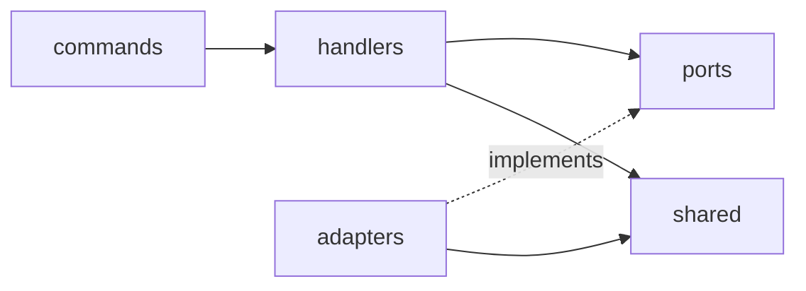
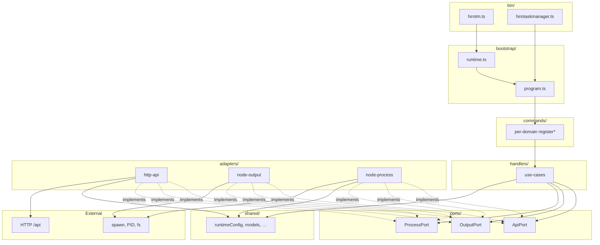
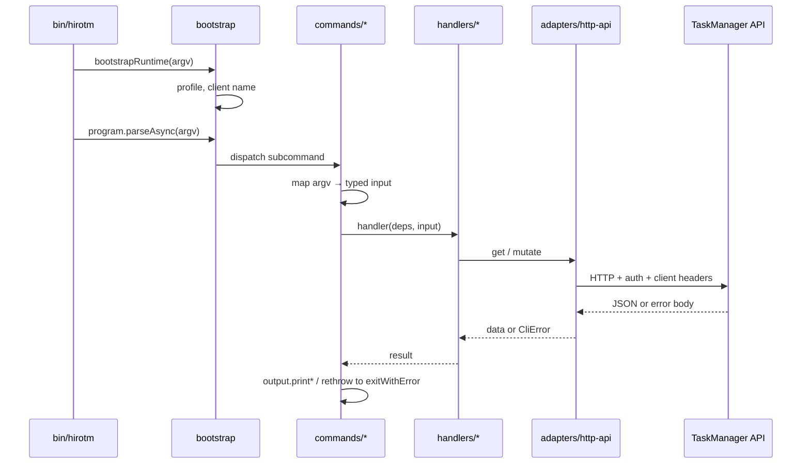

# CLI surface — target re-architecture

This document describes the **implemented layout** for the `hirotm` / `hirotaskmanager` CLI under `src/cli/`. Phases 1–3 are **complete**. Optional **`ports/`** + **`adapters/`** (formal DI) remain a future refinement if you want stricter test doubles than **`CliContext`** fakes.

**Phase 1:** Commander split into **`commands/*.ts`** + **`bootstrap/program.ts`** + **`lib/command-helpers.ts`**.

**Phase 2:** **`handlers/*.ts`** + **`CliContext`** (`handlers/context.ts`); **`withCliErrors`** in command-helpers.

**Phase 3:** **`package.json` `bin`** → **`src/cli/bin/hirotm.ts`** and **`src/cli/bin/hirotaskmanager.ts`**. Launcher logic lives in **`bootstrap/launcher.ts`** (`createHirotaskmanagerProgram`, `runHirotaskmanagerCli`). **`index.ts`** / **`app.ts`** re-import the bin entries for old paths and docs.

## Goals

- **Thin entrypoints** — argv bootstrap and `program.parseAsync` only; no thousand-line command registry in one file.
- **Commander at the edge** — option/argument definitions and help text live next to registration; actions delegate inward.
- **Testable core** — use-cases callable without Commander; HTTP and stdout/stderr swappable for tests.
- **Keep what works** — continue to use `shared/` for models, `runtimeConfig`, and CLI access headers; the local HTTP API remains the integration boundary.

## Non-goals

- Replacing Commander or changing the **user-visible** command names and flags (unless intentionally versioned).
- Moving authorization or board policy into the CLI (the server remains authoritative).

## Execution phases

Split the work in **three** passes. Each phase should leave **`hirotm` / `hirotaskmanager` behavior unchanged** from a user perspective and keep **`release:check`** green.

### Phase 1 — Command modules (implemented)

**Outcome:** No thousand-line `index.ts`; Commander wiring lives in per-domain files.

- **`bootstrap/runtime.ts`** — early argv → profile / client name (`applyCliRuntimeFromArgv`).
- **`bootstrap/program.ts`** — `createHirotmProgram()`, `runHirotmCli(argv)`.
- **`commands/*.ts`** — `registerBoardCommands`, `registerListCommands`, `registerTaskCommands`, `registerReleaseCommands`, `registerServerCommands`, `registerStatusCommands`, `registerTrashCommands`, `registerQueryCommands`.
- **`lib/command-helpers.ts`** — `addPortOption`, `addProfileOption`, `parsePortOption`, `collectMultiValue`, `parseLimitOption`.
- **Still import** existing **`lib/api-client`**, **`lib/output`**, **`lib/writeCommands`**, **`lib/trashCommands`** from handlers — no ports layer yet.

### Phase 2 — Handlers and boundaries (implemented)

**Outcome:** Read/query and mutation orchestration is callable without Commander; optional formal ports in Phase 3.

- **`handlers/context.ts`** — `CliContext`, `createDefaultCliContext()` (wires **`resolvePort`**, **`resolveDataDir`**, **`fetchApi`**, **`printJson`**, **`printSearchTable`**, **`startServer`**, **`stopServer`**, **`readServerStatus`**).
- **`handlers/*.ts`** — `handleServerStart`, `handleBoardsList`, …; mutation paths delegate to **`writeCommands`** / **`trashCommands`** with `port` from context.
- **`lib/command-helpers.ts`** — **`withCliErrors`** wraps handler calls so actions stay one-liners.
- **`writeCommands.ts`** — barrel over **`lib/write/*.ts`**; **`trashCommands.ts`** unchanged.
- **Optional follow-up:** introduce **`ports/*`** + **`adapters/*`** behind **`CliContext`** (today use fake **`CliContext`** — see **`handlers/boards.test.ts`**).

### Phase 3 — Bin entrypoints and cleanup (implemented)

**Outcome:** Published binaries are thin shebang files; launcher is bootstrap-owned.

- **`bin/hirotm.ts`** — `applyCliRuntimeFromArgv` + `runHirotmCli(process.argv)`.
- **`bin/hirotaskmanager.ts`** — `runHirotaskmanagerCli(process.argv)`.
- **`bootstrap/launcher.ts`** — installed-app Commander + setup prompts + `startServer` (moved from monolithic **`app.ts`**).
- **`index.ts`** / **`app.ts`** — `import "./bin/hirotm.ts"` and `import "./bin/hirotaskmanager.ts"` so `bun run src/cli/index.ts` and old links keep working.

## Target directory layout

```
src/cli/
  bin/
    hirotm.ts                 # shebang; bootstrap + runCli(argv)
    hirotaskmanager.ts        # shebang → runHirotaskmanagerCli

  bootstrap/
    runtime.ts                # early argv scan → profile + client name (before Commander)
    program.ts                # hirotm: createHirotmProgram, runHirotmCli
    launcher.ts               # hirotaskmanager: createHirotaskmanagerProgram, runHirotaskmanagerCli

  commands/                   # Commander only: .command / .option / .action → delegate
    boards.ts
    lists.ts
    tasks.ts
    releases.ts
    search.ts
    trash.ts
    server.ts                 # start, status → process adapter

  handlers/                   # use-cases; no Commander types (Phase 2: *.ts by domain)
    context.ts
    boards.ts
    server.ts
    …

  ports/                      # interfaces (for tests and clear boundaries)
    api.ts                    # getJson, mutateJson, trashMutate, health
    output.ts                 # printJson, printTable, fail / exitWithError
    process.ts                # startServer, readStatus (if kept separate from api)

  adapters/
    http-api.ts               # implements ApiPort (today’s api-client responsibilities)
    node-output.ts            # implements OutputPort (today’s output.ts)
    node-process.ts           # implements ProcessPort (today’s process.ts)

  lib/                        # small shared CLI helpers (parsePort, body flags, release flags, …)
    writeCommands.ts            # re-exports lib/write/* (stable import path)
    write/
      helpers.ts                # parsePositiveInt, JSON stdin/file, release flags
      boards.ts lists.ts tasks.ts releases.ts
    command-helpers.ts          # Commander option helpers shared by commands/*
    …
```

`package.json` **`bin`** uses **`src/cli/bin/hirotm.ts`** and **`src/cli/bin/hirotaskmanager.ts`**.

## Dependency rule



- **handlers** import **ports** (interfaces) and **shared** types; they do **not** import Commander or Node globals directly if you inject deps.
- **commands** import **handlers** and construct **adapters** once (or receive a `CliContext` bundle).
- **adapters** implement **ports** and may use `fetch`, `fs`, `process`, and **shared/runtimeConfig**.

## Layer diagram



## Typical request flow



## Cross-cutting concerns

### Access policy

| Concern | Where |
|--------|--------|
| **Who may do what** (API keys, board CLI access, roles) | **Server / API only** — authoritative. |
| **Sending credentials** | **adapters/http-api** — read API key via **shared/runtimeConfig** (and profile); set `Authorization` and client identity headers. |
| **“Not configured” UX** | **bootstrap** or **http-api** — optional early check or consistent message on 401; not a second policy engine. |

Handlers should assume: if the call fails, the server response (normalized to `CliError`) explains why.

### Consistent error responses (user-facing)

| Step | Owner |
|------|--------|
| Parse HTTP error JSON/text | **adapters/http-api** |
| Map to a single app error type | **adapters/http-api** → throw **`CliError`** (or port equivalent) |
| Print JSON on stderr + exit code | **adapters/node-output** (`exitWithError` / `printError`) |
| Unhandled exceptions at top level | **bin/** or **bootstrap/program.ts** — same formatter |

### Output formats (stdout)

| Concern | Where |
|--------|--------|
| `--format json\|table` (and defaults) | **commands/** — Commander options |
| Formatting success output | **commands/** calling **OutputPort** with a format, or a small **lib/formatters.ts** |
| Handlers | Prefer returning **structured data**; avoid printing inside handlers for easier tests |

Wire format from the API stays JSON; table vs JSON on stdout is **CLI presentation only**.

### Help (`--help`)

| Concern | Where |
|--------|--------|
| Per-subcommand descriptions and flags | **commands/** — `.description()`, `.argument()`, `.option()` |
| Global program help and examples | **bootstrap/program.ts** — `.name()`, `.description()`, optional `.addHelpText()` |
| Long documentation | **docs/** (this repo or external); keep `--help` short |

## Relationship to current code

Today, useful pieces map roughly as follows:

| Current | Target home |
|---------|-------------|
| `src/cli/bin/*.ts` | **Canonical** npm binaries (`hirotm`, `hirotaskmanager`) |
| `src/cli/index.ts`, `src/cli/app.ts` | Re-export bin entries for compatibility |
| `src/cli/bootstrap/launcher.ts` | Installed launcher (hirotaskmanager) |
| `lib/api-client.ts` | `adapters/http-api.ts` |
| `lib/config.ts` | stays thin or inlined into adapters using **shared/runtimeConfig** |
| `lib/output.ts` | `adapters/node-output.ts` |
| `lib/process.ts` | `adapters/node-process.ts` |
| `lib/writeCommands.ts` | Barrel re-export; implementations in **`lib/write/*.ts`** + **`lib/write/helpers.ts`** |
| `lib/trashCommands.ts` | `handlers/trash/*` or `handlers/trash.ts` |
| `lib/write-result.ts`, `task-body.ts`, `emoji-cli.ts` | `lib/` or co-located with handlers |

## Summary

- **Commander** and **help** live in **commands/** + **bootstrap/program.ts**.
- **Use-cases** live in **handlers/** and depend on **ports/** (or a temporary `CliContext`).
- **HTTP, process, stderr JSON** live in **adapters/**.
- **Policy** stays on the **server**; the CLI **authenticates** and **normalizes errors** for a single user-facing shape.

Update this doc when you add **`ports/`** / **`adapters/`** or change **`bin`** paths.

---

## Status

**Phases 1–3: complete.** **`writeCommands`** is split into **`lib/write/{boards,lists,tasks,releases}.ts`** with shared **`lib/write/helpers.ts`**; **`writeCommands.ts`** remains the stable import path. Further work is optional (formal **`ports/`** / **`adapters/`**, more handler tests).
