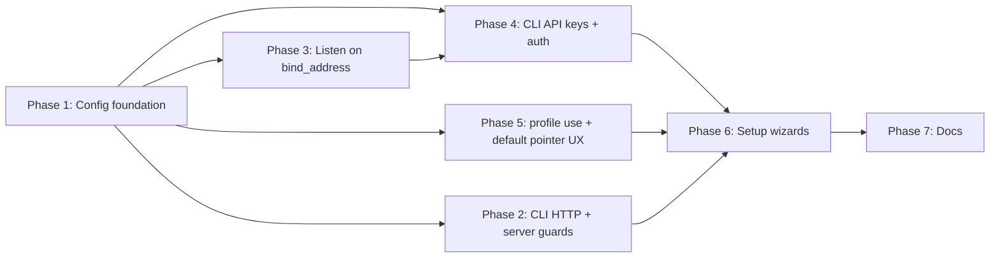

# Remote CLI Access — Phased Implementation Plan

This document turns [remote-cli-access-design.md](./remote-cli-access-design.md) into **implementation phases** with clear boundaries. Each phase is mergeable on its own, has explicit **exit criteria**, and lists **dependencies** on earlier phases.

**Source of truth:** All field names, validation rules, and UX copy live in the design doc (especially §2). This plan only sequences work.

**Initial development mode:** No backward compatibility with pre-role profiles unless a migration is explicitly added; invalid or missing `role` fails fast with `CLI_ERR.invalidConfig` (see project rules).

---

## Dependency graph (high level)

- **Phase 4** needs **Phase 3** so `resolveRequireCliApiKey()` and real exposure match how the server listens (loopback vs all interfaces).
- **Phase 6** needs **Phase 2** (CLI targets URLs correctly), **Phase 4** (inline `api-key generate`), and **Phase 5** (default profile pointer usable from wizards).

---

## Phase 1 — Config schema, validation, and resolvers

**Goal:** One place defines profile shape, role rules, and `resolveApiUrl` / related resolvers. No HTTP server behavior change yet beyond reading new fields if already present.

**In scope**

- `RuntimeConfigFile`: `role`, server-only fields (`port`, `data_dir`, `auth_dir`, `open_browser`, `bind_address`, `require_cli_api_key`, optional `api_key`), client-only `api_url`, client-required `api_key`.
- `TopLevelConfigFile` for `~/.taskmanager/config.json`: `default_profile`.
- Validation per §2.1 (forbidden fields per role, non-loopback ⇒ cannot set `require_cli_api_key: false`, etc.).
- Resolvers: `resolveProfileRole`, `resolveApiUrl` (server ⇒ `http://127.0.0.1:<port>`), `resolveApiKey`, `resolveBindAddress`, `resolveRequireCliApiKey`.
- Read/write helpers for top-level `config.json` (`resolveDefaultProfileName`, `writeDefaultProfileName`).
- **Partial** `resolveProfileName` integration: either implement full default-pointer + single-profile fallback here, or document “completed in Phase 5” — prefer **completing pointer resolution in Phase 1** so manual JSON editing works end-to-end for profile selection.

**Out of scope**

- Changing `buildBaseUrl` behavior (Phase 2).
- Bun `listen` address (Phase 3).
- `cli-api-keys.json`, auth middleware, or `server api-key` commands (Phase 4).
- Interactive wizards (Phase 6).

**Exit criteria**

- [ ] Unit tests for validation matrix (server vs client, illegal combinations rejected with `CLI_ERR.invalidConfig` and field list).
- [ ] Unit tests for `resolveApiUrl` (server vs client).
- [ ] `readProfileConfig` / load path fails loudly on invalid configs (no silent ignore).

**Primary files**

- `src/shared/runtimeConfig.ts` (+ tests alongside or in `*.test.ts`).

---

## Phase 2 — CLI HTTP client: URL, guards, hints

**Goal:** Every CLI request uses `resolveApiUrl`; server lifecycle commands refuse client profiles.

**Depends on:** Phase 1.

**In scope**

- `buildBaseUrl` → `resolveApiUrl` only (§2.2).
- Re-export resolvers from `src/cli/lib/config.ts` as in design §2.3.
- `startServer` / `stopServer`: require `role === "server"` (§2.4).
- `isLoopbackUrl` helper; `buildUnreachableHint` branches per §2.5.
- Ensure outgoing requests attach `Authorization: Bearer` when `resolveApiKey()` returns a value (if not already centralized, do it here).

**Out of scope**

- New commands (`profile use`, setup wizards).
- Server-side auth enforcement (Phase 4).

**Exit criteria**

- [ ] With a hand-crafted **server** profile JSON, `hirotm` hits `http://127.0.0.1:<port>` (derived).
- [ ] With a hand-crafted **client** profile JSON, `hirotm` hits configured `api_url`.
- [ ] `server start` on a client profile exits with clear error (no partial spawn).

**Primary files**

- `src/cli/lib/api-client.ts`
- `src/cli/lib/config.ts`
- `src/cli/lib/process.ts` (or equivalent for start/stop)

---

## Phase 3 — Server listens on `bind_address`

**Goal:** The Bun server binds where the profile says; default matches design (`127.0.0.1`).

**Depends on:** Phase 1 (`resolveBindAddress`).

**In scope**

- Wire `bind_address` from active **server** profile into `src/server/index.ts` (or central server bootstrap).
- Default when missing: `127.0.0.1`.
- Log bind address on startup (helps operators verify exposure).

**Out of scope**

- CLI API key enforcement (Phase 4).
- Reverse proxy documentation (docs Phase 7).

**Exit criteria**

- [ ] Loopback-only profile: server not reachable from LAN by default.
- [ ] Non-loopback profile: server reachable on configured interface; matches `resolveRequireCliApiKey` expectations in Phase 4.

**Primary files**

- `src/server/index.ts` (+ any shared server config helper)

---

## Phase 4 — CLI API keys (storage, commands, middleware)

**Goal:** File-backed keys, `hirotaskmanager server api-key *`, and `authMiddleware` enforcement per §2.6.

**Depends on:** Phase 1 + Phase 3 (exposure model is real).

**In scope**

- `src/server/cliApiKeys.ts`: read/write `<auth_dir>/cli-api-keys.json`, `0o600`, hash-only storage, constant-time verify.
- Commands (filesystem-only, no HTTP server required for generate):
  - `hirotaskmanager server api-key generate [--label] [--save-to-profile]`
  - `hirotaskmanager server api-key list`
  - `hirotaskmanager server api-key revoke <id-prefix>`
- Active profile must be `role === "server"` for these commands (or explicit profile override pointing at server profile).
- `authMiddleware`: `resolveRequireCliApiKey()` drives whether Bearer is mandatory; optional branch for “key sent but enforcement off” per design §2.6.
- Ensure server process resolves config from same profile model as CLI (shared helpers).

**Out of scope**

- Setup wizards calling `generate` (Phase 6).
- Web UI for keys (future).

**Exit criteria**

- [ ] Generate/list/revoke integration or script test against temp auth dir.
- [ ] With `require_cli_api_key: true`, requests without Bearer get `401` with documented code.
- [ ] `--save-to-profile` writes `api_key` to server profile `config.json` when appropriate.

**Primary files**

- `src/server/cliApiKeys.ts`
- `src/server/auth.ts`
- CLI command registration for `hirotaskmanager` / `server api-key` subtree

---

## Phase 5 — Default profile pointer and `profile use`

**Goal:** Operators and agents run `hirotm` with no `--profile` when a default is set.

**Depends on:** Phase 1 (pointer file + helpers). Can ship after Phase 2 for manual testing.

**In scope**

- Finish `resolveProfileName` if not done in Phase 1:
  - `--profile` wins.
  - Else `default_profile` from `~/.taskmanager/config.json`.
  - Else exactly one profile dir with `config.json` ⇒ implicit default (optional: auto-write pointer — product decision; design §2.1).
  - Else error with list of profiles + hint.
- `hirotaskmanager profile use <name>`: validate profile exists, write pointer.

**Out of scope**

- Interactive setup (Phase 6).

**Exit criteria**

- [ ] With two profiles on disk and no pointer, CLI errors with actionable message.
- [ ] After `profile use foo`, `hirotm` uses `foo` without flags.

**Primary files**

- `src/shared/runtimeConfig.ts`
- CLI entry for `profile use` (where subcommands live today)

---

## Phase 6 — First-run and re-run setup wizards

**Goal:** `--setup-server`, `--setup-client`, plain `hirotaskmanager` flow, and `--setup` re-entry per §2.8.

**Depends on:** Phase 2, Phase 4, Phase 5 (wizards should set default profile and optionally mint keys).

**In scope**

- Flags: `--setup-server`, `--setup-client` (mutually exclusive); integrate with existing launcher/setup flow in `launcher.ts` / equivalent.
- Server-mode wizard: friendly questions (“Allow remote access?” maps to `bind_address`, etc.), write server profile, offer default pointer, offer `server api-key generate --save-to-profile` when required, offer `server start`.
- Client-mode wizard: `api_url` + `api_key`, connectivity check (`server status`).
- `hirotaskmanager --setup`: re-run for existing profile; role immutable; pre-filled answers.

**Out of scope**

- Polishing docs (Phase 7).

**Exit criteria**

- [ ] Happy path: fresh machine → `--setup-server` → `hirotm boards list` with no args (default profile + loopback server).
- [ ] Happy path: second machine → `--setup-client` → points at remote HTTPS + key → `hirotm boards list`.

**Primary files**

- `src/cli/bootstrap/launcher.ts` and setup UI/prompts modules
- Any new `setup/` or `wizard/` module if split for clarity

---

## Phase 7 — Documentation pass

**Goal:** External and agent-facing docs match shipped behavior.

**Depends on:** Phase 6 complete (or document “partial” if shipping incrementally — prefer full pass after Phase 6).

**In scope**

- `AGENTS.md` — default profile, no `--profile` for daily use, when to use `hirotaskmanager` vs `hirotm`.
- `README.md` — two-mode setup, VPS + desktop story.
- `hiro-docs` — `profiles.mdx`, `server.mdx`, CLI overview as listed in design §6.

**Exit criteria**

- [ ] Docs do not contradict [remote-cli-access-design.md](./remote-cli-access-design.md).

---

## Future (explicitly out of phased MVP)

- Web UI: Settings → CLI API Keys (list / revoke).
- `hirotaskmanager profile set <field> <value>` (non-interactive edits).

Track these separately so Phase 7 closes the remote-access MVP without scope creep.

---

## Suggested PR / branch strategy

| Phase | Suggested branch name | Notes |
|-------|----------------------|--------|
| 1 | `feat/remote-cli-phase-1-config` | Largest review; get schema right first |
| 2 | `feat/remote-cli-phase-2-cli-http` | Small, easy review after Phase 1 merges |
| 3 | `feat/remote-cli-phase-3-bind` | Small; verify manually with curl from LAN |
| 4 | `feat/remote-cli-phase-4-api-keys` | Security-sensitive; request explicit review |
| 5 | `feat/remote-cli-phase-5-default-profile` | Small UX win |
| 6 | `feat/remote-cli-phase-6-wizards` | Most user-facing churn |
| 7 | `docs/remote-cli-phase-7-docs` | Can split repo vs hiro-docs PRs |

Phases **1–2** can be one PR if the team prefers fewer stops; phases **4** and **6** benefit from staying separate (security vs UX surface).

---

## Traceability: design doc sections → phases

| Design section | Phases |
|----------------|--------|
| §2.1 Profile roles, default profile, schema | 1, 5 |
| §2.2–2.3 `buildBaseUrl`, re-exports | 2 |
| §2.4–2.5 Guards, unreachable hints | 2 |
| §2.6 CLI API keys (full) | 4 |
| §2.7 Examples (manual verification) | 1–4 |
| §2.8 Setup wizards | 6 |
| §4 VPS deployment | 3 + 7 (ops narrative) |
| §7 Quick-starts | Manual QA after 6; documented in 7 |

---

*Last aligned with design doc structure as of the repo copy; if the design doc moves, update the § references here.*
