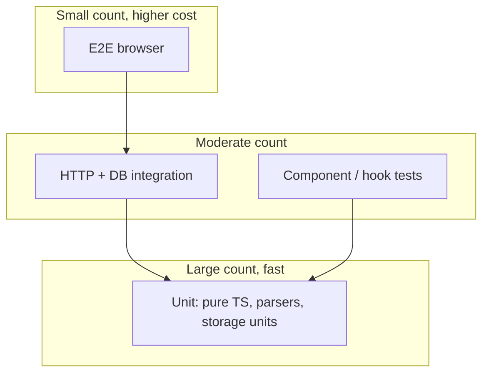

# Testing strategy — options and plan

This document proposes **how to grow automated testing** for TaskManager given the current stack (**Bun**, **TypeScript**, **Hono**, **SQLite**, **Vite + React**, **`bun test`**). It lists **options** (not a single mandated stack), tradeoffs, and an **ambitious phased plan** you can execute over time.

**Status:** Strategy and roadmap. The repo already runs `bun test` and `tsc --noEmit` in `release:check`; implementation details below are targets.

---

## 1. Current state (baseline)

| Area | Today |
|------|--------|
| **Runner** | [Bun test](https://bun.sh/docs/cli/test) — `npm run test` → `bun test` |
| **API** | `describe` / `test` / `expect` from `bun:test` |
| **Discovery** | `*.test.ts` under `src/` (shared, server storage, client deps, CLI trash helpers, …) |
| **Typecheck** | `tsc --noEmit` (separate from tests, in `release:check`) |
| **UI / E2E** | No React Testing Library, Vitest, Playwright, or Cypress in `package.json` |
| **CI gate** | `release:check`: typecheck → `bun test` → build → `npm pack --dry-run` |

**Strengths to preserve:** fast tests, no second JS test runner unless there is a clear payoff, alignment with Bun as the primary runtime.

---

## 2. Principles

1. **Pyramid:** many fast, isolated tests; fewer integration tests; very few E2E tests (until regression risk justifies them).
2. **Authority:** tests should fail when behavior users rely on breaks — prefer **public APIs** (HTTP routes, exported functions, CLI contracts) over testing private implementation.
3. **Hermetic data:** avoid using the developer’s real `data/taskmanager.db`; use **temporary paths** or **`sqlite :memory:`** for automated runs.
4. **CI is the contract:** anything marked “required” should run in **`release:check`** or CI equivalent with **deterministic** ordering and no manual steps.
5. **Cost awareness:** every layer (UI, E2E) adds dependency weight and flake surface; add **options** when value exceeds cost.

---

## 3. Test pyramid (target shape)

---

## 4. Options by layer

Each subsection lists **options A / B / …** with **pros**, **cons**, and **fit** for this repo.

### 4.1 Unit tests (pure TypeScript)

**Default recommendation:** stay on **`bun:test`** for anything that does not need a real DOM or browser.

| Option | Description | Pros | Cons |
|--------|-------------|------|------|
| **A — Bun only (recommended baseline)** | `bun test`, `*.test.ts`, colocated with source | Fast, zero extra runner, matches `package.json` | Jest/Vitest-specific plugins unavailable |
| **B — Vitest for “everything”** | Replace or duplicate with Vitest | Large ecosystem, familiar to many teams | Second runner, config overlap with Bun |
| **C — Split runners** | Bun for server/shared; Vitest for `src/client` only | Each area uses “best” tooling | Two commands in CI, mental overhead |

**Scope examples:** `src/shared/*`, CLI helpers (`src/cli/lib/*` where pure), DnD dependency math, storage helpers that accept injectable DB.

---

### 4.2 Server integration — HTTP (Hono)

| Option | Description | Pros | Cons |
|--------|-------------|------|------|
| **A — In-process `app.request()` (recommended)** | Build Hono app (or minimal route tree), call `app.request(new Request(...))` | No port binding, fast, good for auth/middleware/JSON | Must expose a testable `createApp(deps)` (or similar) |
| **B — Live server on loopback** | Start server on random port, `fetch` from tests | Closest to production wiring | Slower, flakier, more setup/teardown |
| **C — Supertest-style** | If you ever standardize on a helper library | Readable HTTP assertions | Extra dependency; Bun + Hono often don’t need it |

**Fit:** Option **A** aligns with Hono and keeps CI fast. Option **B** is a fallback for bootstrap code that is hard to mount without full process start.

---

### 4.3 Server integration — SQLite

| Option | Description | Pros | Cons |
|--------|-------------|------|------|
| **A — `:memory:` per suite** | Open in-memory DB, run migrations/seeds in `beforeAll` | Fast, no disk leaks | Some SQLite behaviors differ slightly vs file DB |
| **B — Temp file per test file** | `mkdtemp` + `taskmanager.test.db` | Closer to file-backed behavior | Slightly slower; must clean up |
| **C — Shared migrated DB image** | One template DB copied per run | Faster bulk setup | More complex tooling |

**Rule:** never point automated tests at the default dev **`data/taskmanager.db`** unless the test is explicitly labeled **manual / local only**.

---

### 4.4 CLI

| Option | Description | Pros | Cons |
|--------|-------------|------|------|
| **A — Unit-test helpers (current pattern)** | Test pure functions (`trashCommands` id resolution, parsers) | Fast, stable | Does not cover full argv → HTTP |
| **B — Golden / snapshot subprocess** | Spawn `bun run src/cli/bin/hirotm.ts` (or `npm run cli`) with env, assert stdout/stderr | End-to-end CLI contract | Slower; needs API or mocks |
| **C — Refactor toward injectable context** | Handlers receive `fetch` / `printJson` (see `docs/cli-rearchitecture.md`) | Unit + integration without subprocess | Requires structural work |

**Plan:** keep **A** always; add **C** as CLI grows; use **B** sparingly for smoke tests.

---

### 4.5 Client (React + Vite + TanStack Query)

| Option | Description | Pros | Cons |
|--------|-------------|------|------|
| **A — RTL + `happy-dom` + `bun test`** | `@testing-library/react`, DOM env compatible with Bun | Single runner with server tests | Bun + RTL wiring may need iteration |
| **B — Vitest + `jsdom` / `happy-dom`** | Standard Vite + React path | Best docs and examples | Second test command |
| **C — Defer UI tests; rely on E2E only** | Playwright for UI | Fewer moving parts in unit land | Slow feedback, brittle for small components |

**Recommendation trajectory:** start with **A** if you want one runner; choose **B** if the team prioritizes Vite-native DX over uniformity.

---

### 4.6 End-to-end (full stack)

| Option | Description | Pros | Cons |
|--------|-------------|------|------|
| **A — Playwright** | Drive Chromium (and optionally Firefox/WebKit) against local dev URL | Industry default, great traces | CI time, browser install, flake care |
| **B — Cypress** | Similar goals | Strong DX for some teams | Another ecosystem |
| **C — None (manual QA only)** | — | Zero E2E cost | Regressions slip through |

**Recommendation:** introduce **Playwright** only when you have **3–5 critical journeys** worth locking (e.g. login + board load + create task + move column). Keep the suite **minimal**.

---

### 4.7 CI / automation

| Option | Description |
|--------|-------------|
| **A — Extend `release:check`** | Add `npm run test:integration` or `npm run test:e2e` when those suites exist |
| **B — Parallel jobs** | typecheck + unit in one job; E2E in another with cached browsers |
| **C — Path filters** | Run E2E only when `src/client` or e2e specs change (advanced) |

---

## 5. Proposed plan (ambitious, phased)

Phases are **ordered dependencies**: complete earlier phases before leaning hard on later ones. Durations are **suggestions** — adjust to team bandwidth.

### Phase 0 — Harden the baseline (ongoing)

- Keep **`bun test`** as the default for new **pure** logic.
- Add tests when touching **bug-prone** or **high-value** modules (shared filters, merge logic, storage edge cases).
- **Definition of done for risky PRs:** new behavior has at least one test at the lowest feasible layer.

**Exit criteria:** No regression in `release:check`; contributors know where to add `*.test.ts`.

---

### Phase 1 — Hono integration harness (target: short sprint)

- Introduce a **test app factory** (e.g. `createTestApp({ db })`) used only from tests.
- Add **5–15** integration tests for **critical API surfaces**: health, boards list, one mutation path, one auth failure path (as applicable).
- Use **`:memory:` or temp-file SQLite** with migrations applied in test setup.

**Exit criteria:** CI runs these tests in under a few seconds; no fixed port required.

---

### Phase 2 — Storage and route coverage expansion (target: multi-sprint)

- Raise coverage on **`src/server/storage`** patterns you rely on for releases (trash, releases, task groups) — align with existing `*.test.ts` style.
- Add route tests for **CLI-backed** or **integration-sensitive** endpoints (search, trash restore, etc.) via the Phase 1 harness.

**Exit criteria:** Breaking API changes are caught by tests before manual `hirotm` checks.

---

### Phase 3 — Client testing (target: after Phase 1 stable)

- Pick **4.5 Option A or B** and document the **single** command for UI tests (e.g. `npm run test:client`).
- Add RTL tests for **non-trivial** components (dialogs, DnD-adjacent logic extracted to hooks, command palette).
- Use **TanStack Query** patterns: `QueryClientProvider` + `queryClient.setQueryData` or small wrapper hooks for testability.

**Exit criteria:** At least one representative component/hook suite runs in CI; flakiness budget near zero.

---

### Phase 4 — CLI depth (target: aligns with `docs/cli-rearchitecture.md`)

- Extract or add **testable handlers** with injected HTTP/output (Phase **C** in §4.4).
- Add **subprocess smoke** tests only for **1–2** commands if needed (e.g. `hirotm status` JSON shape against a mocked server or test server).

**Exit criteria:** CLI refactors don’t require manual full command matrix verification.

---

### Phase 5 — Playwright E2E (target: optional milestone)

- Add Playwright with **install** and **`playwright.config.ts`** targeting local base URL.
- Implement **3–5** scenarios; run in CI on `main` / release branches or nightly if full run is heavy.

**Exit criteria:** E2E failures are actionable (traces/screenshots); suite runtime bounded (e.g. &lt; 10–15 min with cache).

---

## 6. Roadmap summary

| Phase | Focus | Primary tooling |
|-------|--------|-----------------|
| 0 | Baseline unit tests | `bun test` |
| 1 | HTTP integration | Hono `app.request`, temp DB |
| 2 | Storage + API breadth | `bun test` + harness |
| 3 | React | RTL + `happy-dom` **or** Vitest |
| 4 | CLI | Pure tests + injectable handlers + rare subprocess |
| 5 | E2E | Playwright (minimal suite) |

---

## 7. Metrics (optional, to avoid endless growth)

- **Unit + integration:** track **time** (`bun test` &lt; 60s as a soft goal; adjust upward if storage suite grows).
- **E2E:** cap **scenario count** unless a new journey is **release-blocking**.
- **Flakes:** any flaky test is **fixed or quarantined** within the same sprint.

---

## 8. See also

- **`docs/cli-rearchitecture.md`** — target CLI layout to make handler-level testing easier.
- **`package.json`** scripts: `test`, `typecheck`, `release:check`.

---

## 9. Document maintenance

Update this file when:

- You add a **second** test runner or E2E tool.
- **CI** no longer matches the phases described here.
- You **explicitly choose** Option A vs B for client or E2E (record the decision in a short “Resolved” subsection at the top).
